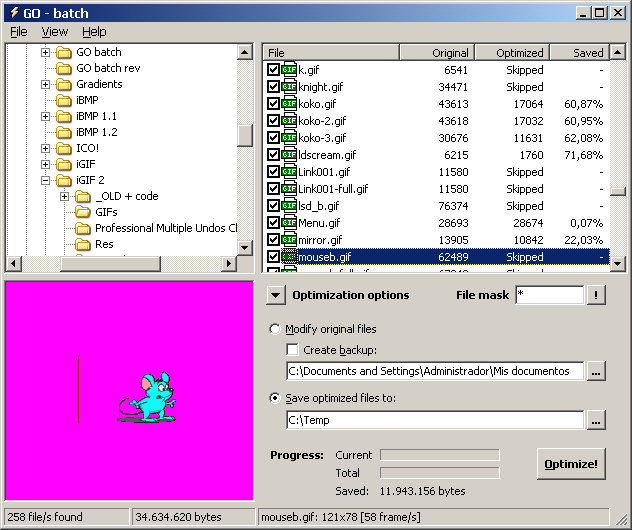



## GIF optimizer \- batch version

### Description

GIF optimizer - batch version (v 1.0.9): Optimize the file size of your animated GIFs (not destructive, I hope!). Don't forget to compile first! :-) 

----

Last update: 2004/06/24 (Comments supported) 

----

Zip 53Kb.
 
### More Info
 

             |
---                |---
**Submitted On**   |2004-06-28 18:18:18
**By**             |[Carles P\.V\.](https://github.com/Planet-Source-Code/PSCIndex/blob/master/ByAuthor/carles-p-v.md)
**Level**          |Intermediate
**User Rating**    |5.0 (60 globes from 12 users)
**Compatibility**  |VB 6\.0
**Category**       |[Complete Applications](https://github.com/Planet-Source-Code/PSCIndex/blob/master/ByCategory/complete-applications__1-27.md)
**World**          |[Visual Basic](https://github.com/Planet-Source-Code/PSCIndex/blob/master/ByWorld/visual-basic.md)
**Archive File**   |[GIF\_optimi1763366282004\.zip](https://github.com/Planet-Source-Code/carles-p-v-gif-optimizer-batch-version__1-48237/archive/master.zip)

